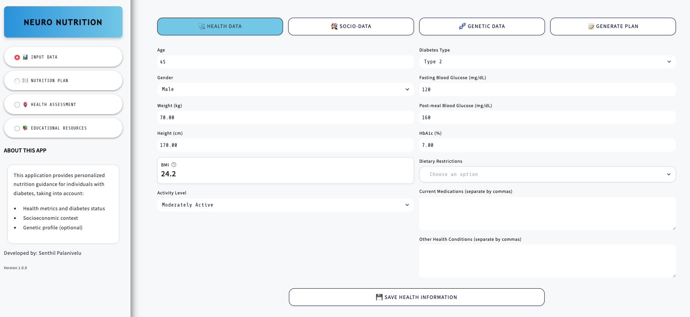
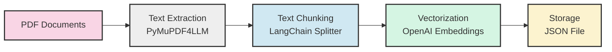

# Neuro Nutrition

This AI-powered application provides personalized nutrition guidance for individuals with diabetes, taking into account:

- Health metrics and diabetes status
- Socioeconomic context
- Genetic profile (optional)



The app uses OpenAI's GPT-4 to generate tailored recommendations based on the user's input data.

## Live Application

Access the live application at: [https://diabetes-nutrition.streamlit.app/](https://diabetes-nutrition.streamlit.app/)

## Project Structure

The application is organized in a modular structure to promote maintainability and separation of concerns:

```
diabetes_nutrition_plan/
│
├── app.py                # Main application entry point
│
├── utils/                # Utility modules
│   ├── __init__.py              # Package initialization
│   ├── data_processing.py       # Data validation and preprocessing functions
│   ├── llm_integration.py       # OpenAI API integration for generating content
│   ├── genetic_processing.py    # Processes genetic data and analyzes markers
│   ├── genetic_llm_integration.py # Integrates genetic insights with OpenAI API
│   ├── ui_components.py         # UI-related functions and components
│   ├── genetic_ui_components.py # Genetic data UI functions and visualizations
│   └── visualization.py         # Functions for creating visualizations
│
├── app_pages/            # Application pages/screens
│   ├── __init__.py                       # Package initialization
│   ├── input_page.py                     # User input collection page
│   ├── nutrition_plan_page.py            # Nutrition plan display page
│   ├── health_assessment_page.py         # Health assessment page
│   └── educational_resources_page.py     # Educational resources page
│
├── example_data/         # Sample data for demonstration
│   └── sample_23andme.txt              # Sample genetic data file
│
├── requirements.txt      # Project dependencies
└── README.md             # Project documentation
```

# Diabetes Nutrition App Directory Structure

Here's an explanation of the project structure and what each file does:

## Root Directory

- **app.py**: Main entry point for the application, handles navigation between pages

## utils/ Directory - Utility Functions

- **\_\_init\_\_.py**: Makes the utils directory a Python package for easier imports
- **data_processing.py**: Handles validation and transformation of user input data
- **llm_integration.py**: Manages interactions with OpenAI API for generating nutrition plans
- **genetic_processing.py**: Processes genetic data files and analyzes genetic markers
- **genetic_llm_integration.py**: Integrates genetic insights into OpenAI prompts
- **ui_components.py**: Contains reusable UI elements and styling for the application
- **genetic_ui_components.py**: Provides UI for genetic data input and visualization
- **visualization.py**: Creates charts and visual elements for health metrics

## app_pages/ Directory - Application Pages

- **\_\_init\_\_.py**: Makes the app_pages directory a Python package
- **input_page.py**: Handles collection of health, socioeconomic, and genetic data
- **nutrition_plan_page.py**: Displays the generated nutrition plan with recommendations
- **health_assessment_page.py**: Shows health metrics and detailed health assessment
- **educational_resources_page.py**: Provides educational content about diabetes

## example_data/ Directory

- **sample_23andme.txt**: Sample genetic data file for demonstration purposes

# Genetic Data Input Format

For the diabetes nutrition app, the genetic data should be in one of these standard formats:

## 1. 23andMe Raw Data Format

```
# rsid  chromosome  position  genotype
rs7903146   10    114758349    C/T
rs1801282    3     12393125    C/G
rs5082       1    161192056    C/T
```

- Each line represents one genetic marker
- Four columns separated by tabs or spaces
- Contains: marker ID (rsid), chromosome number, position, and genotype
- Lines beginning with # are comments and will be ignored

## 2. Ancestry DNA Format

Very similar to 23andMe format, with minor variations in header formatting

## 3. VCF Format (Variant Call Format)

A more technical standard format used for storing gene sequence variations:

```
#CHROM  POS     ID        REF  ALT  QUAL FILTER INFO                   FORMAT
10      114758349  rs7903146  C    T    .    .     RS=7903146;...       GT:GQ  0/1:99
```

## Key Markers Used by the App

The application specifically analyzes these genetic markers:

- **rs7903146** (TCF7L2 gene) - Carbohydrate metabolism
- **rs1801282** (PPARG gene) - Insulin sensitivity
- **rs5082** (APOA2 gene) - Saturated fat sensitivity
- **rs9939609** (FTO gene) - Satiety response
- **rs1801133** (MTHFR gene) - Folate processing
- **rs762551** (CYP1A2 gene) - Caffeine metabolism
- **rs1800795** (IL6 gene) - Inflammatory response

A sample file is provided in `example_data/sample_23andme.txt` that can be used for demonstration purposes.

## Requirements

The application requires the following Python packages:

```
streamlit>=1.22.0
openai>=1.0.0
pandas>=1.5.0
numpy>=1.22.0
matplotlib>=3.5.0
Pillow>=9.0.0
python-dotenv>=0.20.0
scikit-learn>=1.0.0
markdown>=3.4.0
```

Install all required packages using:

```bash
pip install -r requirements.txt
```

## Getting Started

1. Clone the repository:

   ```bash
   git clone https://github.com/senthilcaesar/diabetes-nutrition-app.git
   cd diabetes-nutrition-app
   ```

2. Install the required dependencies:

   ```bash
   pip install -r requirements.txt
   ```

3. Set your OpenAI API key in Streamlit secrets.toml file:

   ```toml
   OPENAI_API_KEY = "your-api-key-here"
   ```

4. Run the application:
   ```bash
   streamlit run app.py
   ```

## Features

- Collects comprehensive health and socioeconomic data
- Generates personalized nutrition plans using AI
- Visualizes health metrics and nutrition guidelines
- Provides educational resources about diabetes management
- Adapts recommendations based on cultural preferences and socioeconomic factors
- Includes a RAG (Retrieval-Augmented Generation) Q&A system for answering questions about diabetes and nutrition from PDF documents

## RAG Q&A System

The application includes a Retrieval-Augmented Generation (RAG) Q&A system that allows users to ask questions about diabetes and nutrition. The system retrieves relevant information from PDF documents in the data directory and generates accurate answers based on the content of these documents.

### How it Works

1. PDF documents in the `data` directory are processed to extract text
2. The text is split into smaller chunks and converted to vector embeddings
3. When a user asks a question, the system finds the most relevant chunks using vector similarity
4. These relevant chunks are used as context to generate an accurate answer using OpenAI's models
5. The system provides the answer along with the source documents used

### Setting Up the RAG System

1. Add your PDF documents to the `data` directory
2. Create a `.env` file based on the `.env.example` template and add your OpenAI API key
3. Install the required dependencies: `pip install -r requirements.txt`
4. Run the ingestion script to process the documents: `python ingest_documents.py`
5. Launch the application: `streamlit run app.py`
6. Navigate to the "Q&A" tab to start asking questions

### RAG System Implementation Details

The RAG system was implemented through the following steps and components:

#### 1. Core RAG Functionality (`utils/rag_system.py`)

This module contains the core functions for the RAG system:

```python
# Key functions in rag_system.py
def cosine_similarity(vec1, vec2):
    # Calculate similarity between two vectors

def ingest_documents(data_dir, output_file):
    # Process PDF documents, extract text, generate embeddings

def load_chunks(file_path):
    # Load preprocessed chunks from JSON file

def find_similar_chunks(question, all_chunks, top_k=5):
    # Find chunks most similar to the question using vector similarity

def generate_response(question, relevant_chunks, model="gpt-4o"):
    # Generate a response using the question and relevant chunks as context
```

The implementation uses:

- **Vector Similarity**: Cosine similarity to find relevant text chunks
- **Embedding Generation**: OpenAI's text-embedding-3-small model
- **Context-Based Generation**: Using retrieved chunks as context for GPT-4o

#### 2. Document Processing (`ingest_documents.py`)

A standalone script that:

- Extracts text from PDF files using PyMuPDF4LLM
- Splits text into manageable chunks using LangChain's RecursiveCharacterTextSplitter
- Generates embeddings for each chunk
- Saves the chunks with embeddings to a JSON file

```python
# Document processing workflow
# 1. Load PDF files from data directory
# 2. Extract text using pymupdf4llm.to_markdown()
# 3. Split text into chunks using RecursiveCharacterTextSplitter
# 4. Generate embeddings for each chunk using OpenAI's embedding model
# 5. Save chunks with embeddings to JSON file
```

##### Document Processing Workflow Diagram

The following diagram illustrates the document ingestion process:



This process transforms raw PDF documents into searchable vector representations that can be efficiently queried to find relevant information for user questions.

#### 3. User Interface (`app_pages/rag_qa_page.py`)

The Q&A interface that:

- Provides a text input for user questions
- Displays answers with source citations
- Shows relevant passages from source documents
- Tracks question history
- Includes admin options for reingesting documents

```python
def show_rag_qa_page():
    # Display the RAG Q&A interface
    # Check if knowledge base exists
    # Process user questions
    # Display answers with sources
    # Track question history
```

#### 4. Application Integration

The RAG system was integrated into the existing application by:

- Adding a new page to the application (`app_pages/rag_qa_page.py`)
- Updating the sidebar navigation to include a "Q&A" tab
- Ensuring consistent styling with the rest of the application
- Adding environment variable handling for API keys

#### 5. Environment Configuration

The system uses:

- `.env` file for storing API keys and configuration
- Streamlit secrets for secure API key handling in the deployed application
- Flexible API key retrieval that works both in standalone scripts and within the Streamlit app

#### 6. Error Handling and User Experience

The implementation includes:

- Comprehensive error handling for API failures
- Clear user feedback during document processing
- Informative messages about the RAG system's functionality
- Admin options for maintaining the knowledge base

# Tech Stack for Personalized Diabetes Nutrition Plan

This application is built using the following technologies:

## Core Framework

- **Streamlit**: The main web application framework that powers the user interface and interactive components

## Python Libraries

- **Python 3.9+**: The primary programming language
- **OpenAI**: API integration for generating personalized health assessments and nutrition plans
- **Matplotlib**: For creating visualizations of health metrics
- **Pandas**: For data manipulation and processing
- **NumPy**: For numerical operations and array handling
- **PyMuPDF4LLM**: For PDF text extraction in the RAG system
- **LangChain Text Splitters**: For text chunking in the RAG system

## AI Integration

- **OpenAI API**: Using GPT-4 models for generating personalized health assessments and nutrition plans
- **Function Calling**: OpenAI tools framework for structured outputs
- **Embeddings**: Vector representations of text for semantic search in the RAG system

## Data Handling

- **JSON**: For structured data exchange
- **Session State**: Streamlit's session state mechanism for maintaining user data across interactions

## User Interface Components

- **Streamlit Components**: Tabs, containers, columns, expanders
- **Custom CSS**: For styling and theming the application
- **Markdown**: For rich text formatting
- **HTML**: For advanced styling and layout

## Visualization

- **Matplotlib Figures**: Custom visualizations for glucose levels, HbA1c, BMI, and nutrition guides
- **Custom Plots**: Specialized visualizations for genetic data and meal planning

## Genetic Analysis

- **Custom Genetic Processing**: For analyzing genetic markers related to metabolism and nutrition
- **Marker Mapping**: To correlate genetic variants with nutrition recommendations

The application leverages AI to provide tailored nutrition plans based on health metrics, genetic data, and socioeconomic factors for diabetes management.

## Contact

For questions, support, or contributions, please contact:

- **Developer**: Senthil Palanivelu
- **Email**: senthilcaesar@gmail.com

## License

This project is licensed under the MIT License - see the LICENSE file for details.
