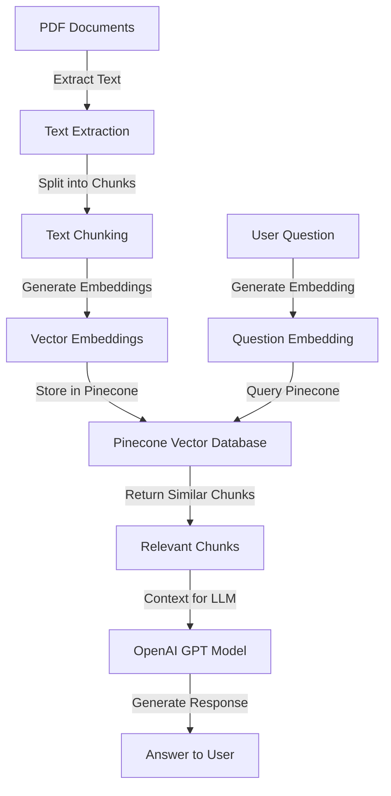

# Diabetes Nutrition App: RAG System with Pinecone

This document explains the Retrieval-Augmented Generation (RAG) system implemented for the Diabetes Nutrition App using Pinecone as the vector database. The system enables users to ask questions about diabetes and nutrition and receive accurate answers based on information extracted from medical literature.

## System Architecture



## Document Ingestion Process

The document ingestion process transforms PDF documents into searchable vector embeddings stored in Pinecone. Here's how it works:

### 1. Text Extraction from PDFs

The system uses `pymupdf4llm` to extract text from PDF files:

```python
md_text = pymupdf4llm.to_markdown(file_path)
```

This converts PDF content to markdown format, preserving document structure while making it suitable for processing. The extraction handles various PDF elements including:

- Text content
- Headers and formatting
- Tables (converted to markdown format)
- Lists and bullet points

### 2. Text Chunking

The extracted text is split into smaller, manageable chunks using LangChain's `RecursiveCharacterTextSplitter`:

```python
text_splitter = RecursiveCharacterTextSplitter.from_tiktoken_encoder(
    model_name="gpt-4o", chunk_size=500, chunk_overlap=125
)
texts = text_splitter.create_documents([md_text])
```

Key chunking parameters:

- **Chunk Size**: 500 characters per chunk
- **Chunk Overlap**: 125 characters overlap between consecutive chunks
- **Tokenizer**: Uses tiktoken with the gpt-4o model for accurate token counting

The overlap ensures that context isn't lost between chunks, which is crucial for maintaining coherence when retrieving information that might span chunk boundaries.

### 3. Embedding Generation

For each text chunk, the system generates a vector embedding using OpenAI's embedding model:

```python
embedding = client.embeddings.create(
    model="text-embedding-3-small",
    input=text
).data[0].embedding
```

These embeddings are dense vector representations (1536 dimensions) that capture the semantic meaning of each text chunk, enabling semantic search rather than just keyword matching.

### 4. Storage in Pinecone

The embeddings, along with their corresponding text and metadata, are stored in a Pinecone vector database:

```python
vector = {
    "id": chunk["id"],
    "values": embedding,
    "metadata": metadata
}
index.upsert(vectors=vectors)
```

Each vector in Pinecone contains:

- **ID**: A unique identifier (e.g., "Diabetes_Code.pdf-42")
- **Values**: The 1536-dimensional embedding vector
- **Metadata**:
  - Source document name
  - Chunk position in the document
  - The original text content
  - Other relevant information

The vectors are stored in batches (100 vectors per batch) to optimize the ingestion process.

## Pinecone Configuration

The system uses Pinecone's serverless configuration for the vector database:

```python
spec = {
    "dimension": 1536,
    "metric": "cosine",
    "serverless": {
        "cloud": "aws",
        "region": "us-east-1"
    }
}
```

Key configuration parameters:

- **Dimension**: 1536 (matching OpenAI's text-embedding-3-small model)
- **Metric**: Cosine similarity for measuring vector distances
- **Cloud Provider**: AWS
- **Region**: us-east-1 (compatible with free tier)

## How the System Answers Your Questions: A Simple Explanation

When you ask a question through the Q&A interface, the system works like a smart research assistant to find the most relevant information from the medical documents and provide you with an accurate answer. Here's how it works in simple terms:

### Step 1: Understanding Your Question

When you type a question like "What is insulin resistance?", the system needs to understand what your question means. It does this by:

1. Taking your question text
2. Sending it to OpenAI's embedding model
3. Getting back a special numerical "fingerprint" (a vector of 1536 numbers) that represents the meaning of your question
4. This fingerprint captures the essence of what you're asking about

Think of this like translating your question into a special code that computers can understand and compare.

### Step 2: Searching for Relevant Information

Once your question has been converted into this numerical fingerprint, the system:

1. Sends this fingerprint to the Pinecone database
2. Pinecone compares your question's fingerprint to the fingerprints of all the document chunks stored in its database
3. Finds the chunks that are most similar in meaning to your question
4. Returns the top 5 most relevant chunks of text

This is similar to how a librarian might quickly scan through books to find passages that answer your question, but using mathematical similarity instead of human judgment.

### Step 3: Gathering the Best Context

Not all the retrieved chunks might be equally relevant, so the system:

1. Evaluates how closely each chunk matches your question
2. Keeps chunks that have a similarity score above 0.7 (on a scale where 1.0 would be a perfect match)
3. Always includes at least the top 2 most relevant chunks, even if their scores are lower
4. Combines these selected chunks into a comprehensive context

This is like a researcher gathering the most relevant paragraphs from different sources to prepare a complete answer to your question.

### Step 4: Generating a Helpful Answer

With the relevant information gathered, the system:

1. Sends your original question and the gathered context to OpenAI's GPT model
2. Instructs the model to answer based only on the provided context
3. Sets the temperature to 0.3 (making the model focus on factual, consistent information rather than creativity)
4. Receives back a carefully crafted answer that addresses your question using the information from the medical documents

This is similar to how a medical expert would read the relevant research and then explain the answer to you in clear, understandable terms.

### Step 5: Presenting the Answer

Finally, the system displays the answer in the user interface, providing you with information that is:

1. Directly relevant to your specific question
2. Based on verified medical literature about diabetes and nutrition
3. Presented in a clear, readable format

The entire process happens in seconds, allowing you to quickly get accurate information about diabetes and nutrition without having to read through entire medical textbooks yourself.

## Technical Query and Retrieval Process

For those interested in the technical details, here's how the system processes queries:

### 1. Question Embedding

The user's question is converted into a vector embedding using the same OpenAI embedding model:

```python
query_embedding = generate_embedding(query)
```

### 2. Similarity Search

The question embedding is used to query the Pinecone index for similar chunks:

```python
results = index.query(
    vector=query_embedding,
    top_k=top_k,
    include_metadata=True
)
```

Pinecone performs a similarity search using cosine similarity to find the chunks most semantically related to the question. The system retrieves the top-k most similar chunks (default: 5).

### 3. Context Assembly

The retrieved chunks are assembled into a context for the language model:

```python
for i, (chunk, score) in enumerate(relevant_chunks):
    # Only include chunks with similarity above a threshold
    if score < 0.7 and i >= 2:  # Include at least 2 chunks regardless of score
        continue
    context_parts.append(f"[{i+1}] {chunk['text']}")
```

The system:

- Includes chunks with similarity scores above 0.7
- Always includes at least the top 2 chunks regardless of score
- Formats the context with chunk numbers for reference

### 4. Response Generation

The assembled context and the original question are sent to OpenAI's GPT model to generate a response:

```python
response = client.chat.completions.create(
    model="gpt-4o",
    messages=[
        {"role": "system", "content": "You are a helpful assistant..."},
        {"role": "user", "content": prompt}
    ],
    temperature=0.3
)
```

The system uses a low temperature (0.3) to ensure factual, consistent responses based on the provided context.

## Using the RAG System

### Command Line Ingestion

You can ingest documents using the command line:

```bash
python rag/ingest_documents.py
```

Optional arguments:

- `--data_dir`: Directory containing PDF files (default: "./data")
- `--index_name`: Name of the Pinecone index (default: "diabetes-nutrition")
- `--reset`: Delete existing index before ingestion

### Web Interface

The system is integrated into the Streamlit web app:

1. Navigate to the "Q&A" tab
2. The system automatically detects if documents have been ingested
3. If not, you can click "Ingest Documents" to process the PDFs
4. Once documents are ingested, you can ask questions in the text input field
5. Click "Get Answer" to receive a response based on the ingested documents

## Environment Setup

The system requires the following credentials:

### Streamlit Secrets (Preferred Method)

For Streamlit deployment, add these to your `.streamlit/secrets.toml` file:

```toml
OPENAI_API_KEY = "your_openai_api_key"
PINECONE_API_KEY = "your_pinecone_api_key"
PINECONE_ENVIRONMENT = "your_pinecone_environment"
```

### Environment Variables (Alternative)

Alternatively, you can set these as environment variables:

```
OPENAI_API_KEY=your_openai_api_key
PINECONE_API_KEY=your_pinecone_api_key
PINECONE_ENVIRONMENT=your_pinecone_environment
```

These can be set in a `.env` file in the project root directory.

The system will first try to read credentials from Streamlit secrets, and if not found, will fall back to environment variables.

## Technical Requirements

- **Python 3.8+**
- **Dependencies**:
  - pinecone (v6.0.0+) - Note: The official Pinecone package was renamed from `pinecone-client` to `pinecone`
  - openai
  - pymupdf4llm
  - langchain_text_splitters
  - python-dotenv
  - streamlit (for web interface)

## Troubleshooting

### Common Issues

1. **Pinecone Connection Errors**:

   - Verify your API key in Streamlit secrets or environment variables
   - Check if your Pinecone account is active
   - Ensure you're using a supported region for your account tier
   - For Streamlit Cloud deployment, make sure secrets are properly configured in the Streamlit dashboard

2. **OpenAI API Errors**:

   - Verify your OpenAI API key
   - Check if you have sufficient API credits
   - Ensure you're not exceeding rate limits

3. **Document Ingestion Issues**:

   - Verify PDF files are in the correct directory
   - Check if PDFs are readable and not corrupted
   - Ensure you have sufficient permissions to read the files

4. **Query Issues**:
   - If responses are generic, try rephrasing your question
   - If responses mention missing information, your question might be outside the scope of ingested documents
   - For better results, ask specific questions related to diabetes and nutrition

## Performance Optimization

- **Chunk Size**: Adjust chunk size based on your content. Smaller chunks (300-500 characters) work well for precise retrieval, while larger chunks provide more context.
- **Embedding Model**: The system uses OpenAI's text-embedding-3-small model for a good balance of quality and cost. For higher accuracy, consider using text-embedding-3-large.
- **Similarity Threshold**: Adjust the 0.7 threshold based on your needs. Lower thresholds include more context but might introduce noise.
- **Batch Size**: The default batch size of 100 vectors works well for most cases. For very large documents, consider adjusting this value.

## Security Considerations

- API keys are stored in Streamlit secrets or environment variables, not hardcoded in the code
- Streamlit secrets provide a more secure way to manage credentials in production deployments
- User queries are processed locally before being sent to OpenAI
- Document content is stored in your private Pinecone index
- No user data is shared between different users of the system
