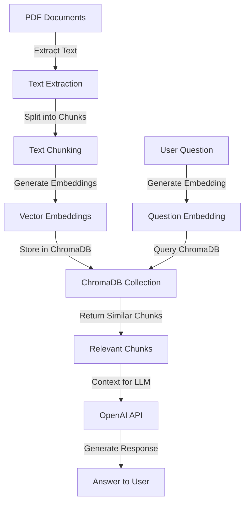

# RAG System with ChromaDB

This directory contains the Retrieval-Augmented Generation (RAG) system for the Diabetes Nutrition App's Q&A functionality.
The system uses ChromaDB for vector storage and retrieval, enabling efficient semantic search over diabetes and nutrition documents.

## System Overview



## How the System Works

### 1. Document Ingestion (`ingest_documents.py`)

The ingestion process transforms PDF documents into searchable vector embeddings:

1. **Text Extraction**: Uses `pymupdf4llm.to_markdown()` to extract text from PDF files in the `data` directory and convert it to markdown format, preserving some document structure.
2. **Text Chunking**: Splits the extracted text into smaller chunks (500 characters with 125 character overlap) using `RecursiveCharacterTextSplitter` with tiktoken encoding based on the "gpt-4o" model for token counting.
3. **Embedding Generation**: Creates vector embeddings for each chunk using OpenAI's `text-embedding-3-small` model, generating dense vector representations of the semantic meaning of each text chunk.
4. **Storage**: Stores the chunks, embeddings, and metadata in a ChromaDB collection named "diabetes_nutrition_docs". If the collection already exists, it's deleted and recreated to ensure fresh data.

#### Data Format in ChromaDB

Each document chunk is stored in ChromaDB with the following components:

1. **IDs**: Unique identifiers for each chunk in the format `{filename}-{chunk_number}` (e.g., "Diabetes_Code.pdf-42").
2. **Documents**: The actual text content of each chunk (500 characters with 125 character overlap).
3. **Embeddings**: Vector representations (arrays of floating-point numbers) generated by the OpenAI embedding model.
4. **Metadata**: Additional information about each chunk:
   - `source`: The filename of the source PDF (e.g., "Diabetes_Code.pdf")
   - `chunk_index`: The position of the chunk within the document (1-based indexing)
   - `total_chunks`: The total number of chunks for the source document

#### Batch Processing

The system processes chunks in batches for each document:

1. All chunks from a single document are processed sequentially
2. Embeddings are generated for each chunk
3. The chunks, with their IDs, text content, embeddings, and metadata, are added to ChromaDB in a single batch operation per document

#### Storage Implementation

ChromaDB is initialized as a persistent client with local storage:

```python
chroma_dir = pathlib.Path(os.path.dirname(__file__)) / "chroma_db"
os.makedirs(chroma_dir, exist_ok=True)
client = chromadb.PersistentClient(path=str(chroma_dir))
```

This ensures that the vector database is stored on disk in the `rag/chroma_db` directory and persists between application restarts.

### 2. Retrieval and Response Generation (`rag_system.py`)

When a user asks a question:

1. **Question Embedding**: Converts the user's question into a vector embedding.
2. **Similarity Search**: Queries the ChromaDB collection to find chunks most similar to the question.
3. **Context Assembly**: Gathers the most relevant chunks to use as context.
4. **Response Generation**: Sends the question and context to OpenAI's GPT model to generate a response.

## Key Components

- **ChromaDB Client**: Manages the vector database for storing and retrieving embeddings.
- **Collection**: Named "diabetes_nutrition_docs", stores document chunks with their embeddings.
- **Metadata**: Each chunk includes metadata about its source document and position.
- **Similarity Search**: Uses vector similarity to find relevant information.

## Important Points to Note

1. **ChromaDB Initialization**: Uses the `PersistentClient` for automatic data persistence:

   ```python
   client = chromadb.PersistentClient(path=str(chroma_dir))
   ```

2. **Embedding Model**: Uses OpenAI's `text-embedding-3-small` for both document chunks and questions.

3. **Chunk Size**: The system uses 500-character chunks with 125-character overlap. Adjust these parameters based on your content if needed.

4. **Similarity Threshold**: The system includes chunks with similarity scores above 0.7 or at least the top 2 chunks regardless of score.

5. **API Key**: Requires an OpenAI API key for generating embeddings and responses.

6. **Data Directory**: PDF documents should be placed in the `rag/data` directory.

## Usage

### Ingesting Documents

Run the ingestion script to process PDF documents:

```bash
python ingest_documents.py
```

This creates a ChromaDB collection with embeddings for all document chunks.

### Querying the System

The RAG system is integrated into the Streamlit app. Users can ask questions through the Q&A interface, and the system will:

1. Find relevant information from the ingested documents
2. Generate a response based on the retrieved context
3. Display the answer to the user

## Customization

- **Embedding Model**: Change the embedding model in both `ingest_documents.py` and `rag_system.py`.
- **Chunk Size**: Adjust the `chunk_size` and `chunk_overlap` parameters in the `RecursiveCharacterTextSplitter`.
- **Collection Name**: Modify the `collection_name` parameter if you want to create multiple collections.
- **Similarity Threshold**: Change the threshold in the `generate_response` function to include more or fewer chunks.

## Troubleshooting

- **Missing API Key**: Set the OpenAI API key in environment variables or `.env` file.
- **No Documents Found**: Ensure PDF files are placed in the `rag/data` directory.
- **ChromaDB Errors**: Check that the ChromaDB directory has proper write permissions.

## SQLite Compatibility Issue

ChromaDB requires SQLite version 3.35.0 or higher. If you encounter the following error:

```
RuntimeError: Your system has an unsupported version of sqlite3. Chroma requires sqlite3 >= 3.35.0.
```

We've implemented the following solution:

1. **SQLite Version Patching**: Created a patch file (`patch_chromadb.py`) that monkey-patches the SQLite version check:

   ```python
   # Monkey patch the sqlite3 module version to bypass the version check
   sqlite3.sqlite_version_info = (3, 35, 0)
   sqlite3.sqlite_version = "3.35.0"

   # Set environment variable to skip SQLite version check
   os.environ["CHROMA_SQLITE_VERSION_CHECK"] = "0"
   ```

2. **Import Order**: Modified `app.py` to import the patch before importing any modules that use ChromaDB:

   ```python
   # Import patch for ChromaDB SQLite compatibility
   import patch_chromadb

   import streamlit as st
   # ... other imports
   ```

3. **Session State for Client Persistence**: Used Streamlit's session state to store the ChromaDB client instance:

   ```python
   # Use Streamlit session state to store the client instance
   if "chroma_client" not in st.session_state:
       # Create a persistent client
       st.session_state.chroma_client = chromadb.PersistentClient(path=str(chroma_dir))

   return st.session_state.chroma_client
   ```

### Data Persistence

With these changes, the RAG system now uses a persistent database that stores data on disk in the `rag/chroma_db` directory. This ensures that:

1. **Data Persistence**: The vector database is stored on disk and persists between application restarts.

2. **Consistent Retrieval**: The system can retrieve previously ingested documents without needing to re-ingest them each time the application starts.

3. **Efficient Resource Usage**: The system doesn't need to regenerate embeddings for the same documents multiple times.

The combination of SQLite version patching and persistent storage provides a robust solution that works across different environments while maintaining data persistence.

## Debugging and Common Issues

### 1. Collection Not Found

If you encounter an error like "ChromaDB collection 'diabetes_nutrition_docs' not found", it means the collection hasn't been created yet. This can happen if:

- You haven't ingested any documents yet
- The collection was deleted
- You're using a different ChromaDB client instance that doesn't have access to the same storage

**Solution**: Click the "Ingest Documents" button on the Q&A page to create the collection.

### 2. Empty Responses

If the system consistently responds with "I don't have enough information to answer this question based on the available documents", it could be due to:

- The question is genuinely not covered in the ingested documents
- The similarity search isn't finding relevant chunks
- The collection is empty or corrupted

**Solution**:

- Try rephrasing your question
- Check if documents were successfully ingested
- Try re-ingesting the documents
- Examine the `rag/chroma_db` directory to ensure it contains data

### 3. OpenAI API Key Issues

If you encounter errors related to the OpenAI API, it could be due to:

- Missing API key
- Invalid API key
- API rate limits
- API service disruptions

**Solution**:

- Ensure your OpenAI API key is set in the `.env` file or environment variables
- Check your API key usage and limits on the OpenAI dashboard
- Verify the API is operational

## Performance Considerations

### 1. Memory Usage

The RAG system's memory usage depends on:

- Number of documents ingested
- Size of the documents
- Chunk size and overlap
- Number of embeddings stored

For large document collections, consider:

- Increasing chunk size to reduce the number of chunks
- Using a more efficient embedding model
- Implementing pagination for large result sets

### 2. Response Time

Several factors affect response time:

- Time to generate embeddings for the question
- Time to search for similar chunks
- Time to generate the response from the LLM

To improve response time:

- Use a faster embedding model
- Optimize the number of chunks returned by the similarity search
- Cache frequently asked questions and their responses
- Use a faster LLM for response generation
