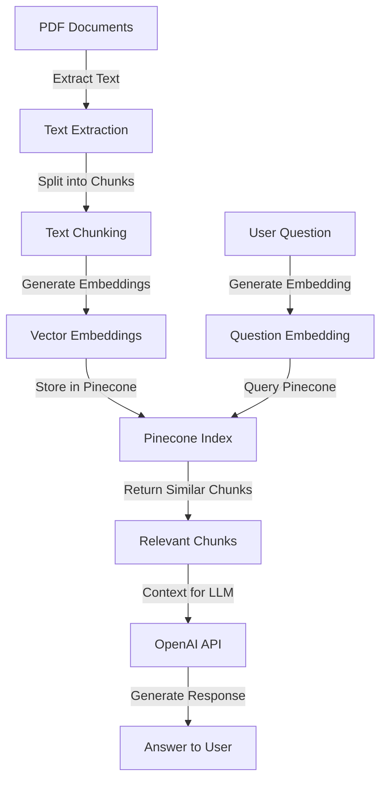

# RAG System with Pinecone

This directory contains the Retrieval-Augmented Generation (RAG) system for the Diabetes Nutrition App's Q&A functionality.
The system uses Pinecone for vector storage and retrieval, enabling efficient semantic search over diabetes and nutrition documents.

## System Overview



## How the System Works

### 1. Document Ingestion (`ingest_documents.py`)

The ingestion process transforms PDF documents into searchable vector embeddings:

1. **Text Extraction**: Uses `pymupdf4llm.to_markdown()` to extract text from PDF files in the `data` directory and convert it to markdown format, preserving some document structure.
2. **Text Chunking**: Splits the extracted text into smaller chunks (500 characters with 125 character overlap) using `RecursiveCharacterTextSplitter` with tiktoken encoding based on the "gpt-4o" model for token counting.
3. **Embedding Generation**: Creates vector embeddings for each chunk using OpenAI's `text-embedding-3-small` model, generating dense vector representations of the semantic meaning of each text chunk.
4. **Storage**: Stores the chunks, embeddings, and metadata in a Pinecone index named "diabetes-nutrition". If the index already exists, you can choose to reset it to ensure fresh data.

#### Data Format in Pinecone

Each document chunk is stored in Pinecone with the following components:

1. **IDs**: Unique identifiers for each chunk in the format `{filename}-{chunk_number}` (e.g., "Diabetes_Code.pdf-42").
2. **Values**: Vector representations (arrays of floating-point numbers) generated by the OpenAI embedding model.
3. **Metadata**: Additional information about each chunk:
   - `source`: The filename of the source PDF (e.g., "Diabetes_Code.pdf")
   - `chunk_index`: The position of the chunk within the document (1-based indexing)
   - `total_chunks`: The total number of chunks for the source document
   - `text`: The actual text content of each chunk (stored in metadata for retrieval)

#### Batch Processing

The system processes chunks in batches for each document:

1. All chunks from a single document are processed sequentially
2. Embeddings are generated for each chunk
3. The chunks, with their IDs, embeddings, and metadata, are added to Pinecone in batches (100 vectors per batch)

#### Storage Implementation

Pinecone is initialized with API key and environment from environment variables:

```python
api_key = os.environ.get("PINECONE_API_KEY")
environment = os.environ.get("PINECONE_ENVIRONMENT")
pc = pinecone.Pinecone(api_key=api_key, environment=environment)
```

This ensures that the vector database is stored in the cloud and accessible from anywhere.

### 2. Retrieval and Response Generation (`rag_system.py`)

When a user asks a question:

1. **Question Embedding**: Converts the user's question into a vector embedding.
2. **Similarity Search**: Queries the Pinecone index to find chunks most similar to the question.
3. **Context Assembly**: Gathers the most relevant chunks to use as context.
4. **Response Generation**: Sends the question and context to OpenAI's GPT model to generate a response.

## Key Components

- **Pinecone Client**: Manages the vector database for storing and retrieving embeddings.
- **Index**: Named "diabetes-nutrition", stores document chunks with their embeddings.
- **Metadata**: Each chunk includes metadata about its source document, position, and the text content.
- **Similarity Search**: Uses vector similarity to find relevant information.

## Important Points to Note

1. **Pinecone Initialization**: Requires API key and environment from environment variables:

   ```python
   api_key = os.environ.get("PINECONE_API_KEY")
   environment = os.environ.get("PINECONE_ENVIRONMENT")
   ```

2. **Embedding Model**: Uses OpenAI's `text-embedding-3-small` for both document chunks and questions.

3. **Chunk Size**: The system uses 500-character chunks with 125-character overlap. Adjust these parameters based on your content if needed.

4. **Similarity Threshold**: The system includes chunks with similarity scores above 0.7 or at least the top 2 chunks regardless of score.

5. **API Keys**: Requires both an OpenAI API key for generating embeddings and responses, and a Pinecone API key for vector storage and retrieval.

6. **Data Directory**: PDF documents should be placed in the `rag/data` directory.

## Usage

### Ingesting Documents

Run the ingestion script to process PDF documents:

```bash
python ingest_documents.py
```

This creates a Pinecone index with embeddings for all document chunks.

Optional arguments:

- `--data_dir`: Directory containing PDF files (default: "./data")
- `--index_name`: Name of the Pinecone index (default: "diabetes-nutrition")
- `--reset`: Delete existing index before ingestion

Example:

```bash
python ingest_documents.py --data_dir ./my_documents --index_name my-custom-index --reset
```

### Querying the System

The RAG system is integrated into the Streamlit app. Users can ask questions through the Q&A interface, and the system will:

1. Find relevant information from the ingested documents
2. Generate a response based on the retrieved context
3. Display the answer to the user

## Customization

- **Embedding Model**: Change the embedding model in the `generate_embedding` function in `pinecone_utils.py`.
- **Chunk Size**: Adjust the `chunk_size` and `chunk_overlap` parameters in the `RecursiveCharacterTextSplitter`.
- **Index Name**: Modify the `index_name` parameter if you want to create multiple indexes.
- **Similarity Threshold**: Change the threshold in the `generate_response` function to include more or fewer chunks.

## Troubleshooting

- **Missing API Keys**: Set the OpenAI API key and Pinecone API key in environment variables or `.env` file.
- **No Documents Found**: Ensure PDF files are placed in the `rag/data` directory.
- **Pinecone Errors**: Check that your Pinecone API key and environment are correct and that your account has the necessary permissions.

## Environment Variables

The following environment variables are required:

- `OPENAI_API_KEY`: Your OpenAI API key
- `PINECONE_API_KEY`: Your Pinecone API key
- `PINECONE_ENVIRONMENT`: Your Pinecone environment (e.g., "gcp-starter", "us-west1-gcp", etc.)

You can set these in a `.env` file in the project root directory.

## Debugging and Common Issues

### 1. Index Not Found

If you encounter an error like "Index 'diabetes-nutrition' not found", it means the index hasn't been created yet. This can happen if:

- You haven't ingested any documents yet
- The index was deleted
- You're using a different Pinecone environment

**Solution**: Click the "Ingest Documents" button on the Q&A page to create the index.

### 2. Empty Responses

If the system consistently responds with "I don't have enough information to answer this question based on the available documents", it could be due to:

- The question is genuinely not covered in the ingested documents
- The similarity search isn't finding relevant chunks
- The index is empty or corrupted

**Solution**:

- Try rephrasing your question
- Check if documents were successfully ingested
- Try re-ingesting the documents
- Examine the Pinecone dashboard to ensure the index contains data

### 3. API Key Issues

If you encounter errors related to the OpenAI or Pinecone API, it could be due to:

- Missing API key
- Invalid API key
- API rate limits
- API service disruptions

**Solution**:

- Ensure your API keys are set in the `.env` file or environment variables
- Check your API key usage and limits on the respective dashboards
- Verify the APIs are operational

## Performance Considerations

### 1. Memory Usage

The RAG system's memory usage depends on:

- Number of documents ingested
- Size of the documents
- Chunk size and overlap
- Number of embeddings stored

For large document collections, consider:

- Increasing chunk size to reduce the number of chunks
- Using a more efficient embedding model
- Implementing pagination for large result sets

### 2. Response Time

Several factors affect response time:

- Time to generate embeddings for the question
- Time to search for similar chunks
- Time to generate the response from the LLM

To improve response time:

- Use a faster embedding model
- Optimize the number of chunks returned by the similarity search
- Cache frequently asked questions and their responses
- Use a faster LLM for response generation

### 3. Pinecone Considerations

Pinecone offers different tiers of service with varying limits on:

- Number of vectors
- Number of indexes
- Queries per second
- Vector dimensions

Choose the appropriate tier based on your needs and budget. The free tier (Starter) has limitations but is sufficient for small to medium-sized applications.
